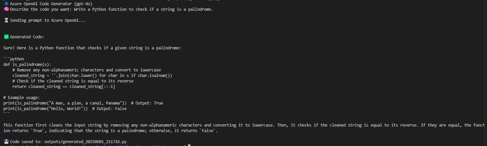

# 🤖 Azure OpenAI Code Generator PoC

This PoC demonstrates how to use Azure OpenAI (e.g., `gpt-4o`) to generate Python code from natural language prompts.

---

## 🧐 What It Does

- Accepts a user prompt like: _“Write a Python function to reverse a string”_
- Sends the prompt to Azure OpenAI
- Displays the generated code in the terminal
- Saves the generated code to a timestamped `.py` file in the `outputs/` folder

---

## ⚙️ Setup

1. Ensure you have Python 3.8+ installed.
2. Clone the repo:

```bash
git clone https://github.com/yeofrancis/Azure-AI.git
cd Azure-AI/codegen-poc
```

3. Create a `.env` file with the following content:

```env
AZURE_OPENAI_KEY=<your-api-key>
AZURE_OPENAI_ENDPOINT=https://<your-resource>.openai.azure.com/
AZURE_OPENAI_DEPLOYMENT=gpt4o-codegen
```

4. Install dependencies:

```bash
pip install -r requirements.txt
```

---

## 🧪 How to Run This App

Run the script:

```bash
python app.py
```

You’ll be prompted to describe the code you want. Example:

```bash
🧠 Describe the code you want: Write a Python function to check for palindromes.
```

---

## 📝 Sample Prompt

> Write a Python function that returns the Fibonacci sequence up to N numbers.

---

## 📁 Output Files

Generated code is saved to the `outputs/` folder with a timestamped filename:

```bash
outputs/generated_20250601_135245.py
```

---

## 🔗 Azure OpenAI Deployment

📌 **Note:** Before using this app, make sure the `gpt-4o` model is deployed.  
See [Azure OpenAI Deployment Guide](../docs/azure-openai-deployment.md) for CLI instructions.

## 📸 Example Output


